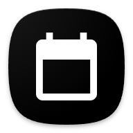
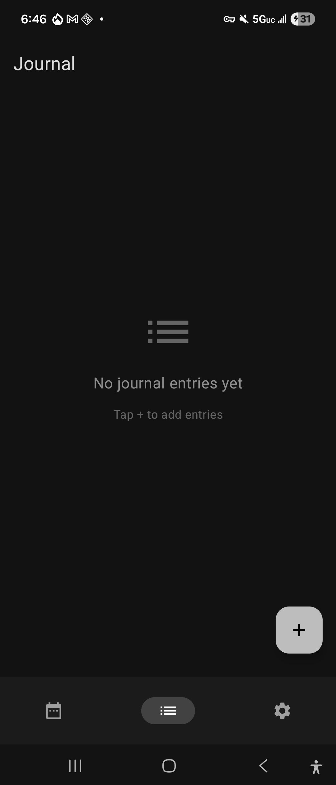
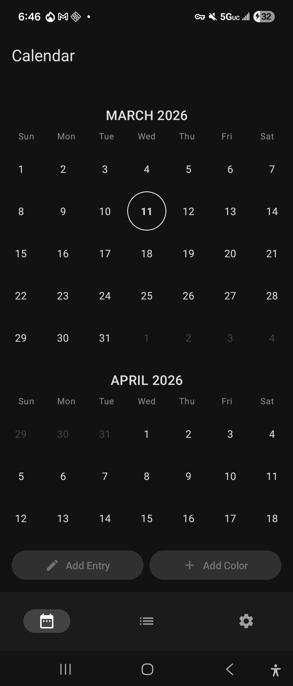
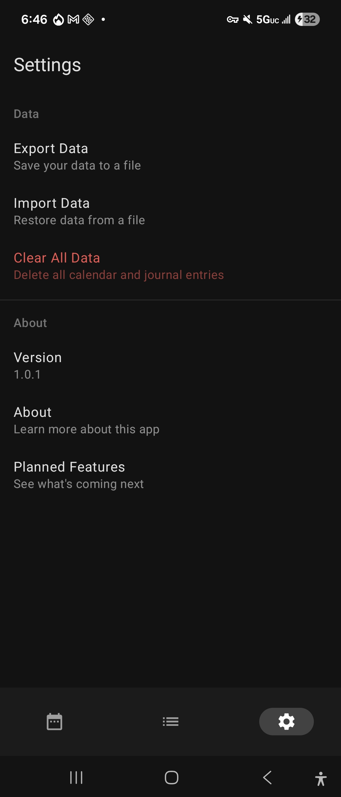
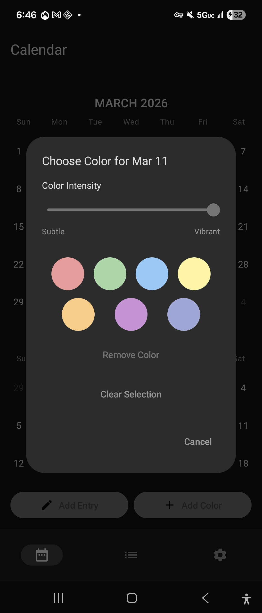
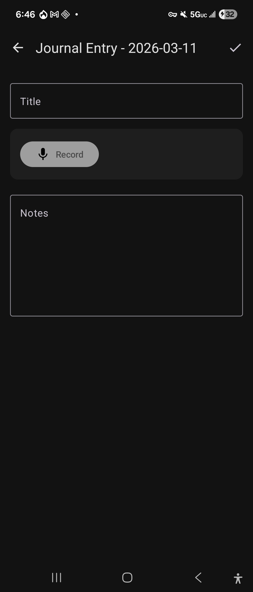

<h1> Calendar314</h1>

## About

Calendar314 is an open source calendar app that can be used to track fitness goals, period cycles, dreams, etc.

Dates can be color coded to indicate different situations and you also have the option to add notes & journal entries to any available dates on the calendar as well. These journal entries can also be seen and read from another screen within the app in a space more centralized for journaling.

All your data is stored locally on your device and can be transferred to subsequent devices with json files. There's an endemic of apps like these being used for data collection and tracking and my moral compass wishes to see that these predatory apps with sign up & telemetry baked in are weeded out of existance. Maybe I can't do all that much but by developing and working on offline apps like these I feel like I'm contributing to a wider network of digital ideals.

## Screenshots

## License

Calendar314 is licensed under the MIT License. See the [LICENSE](LICENSE) file for details.

This app is free and open source software (FOSS).
